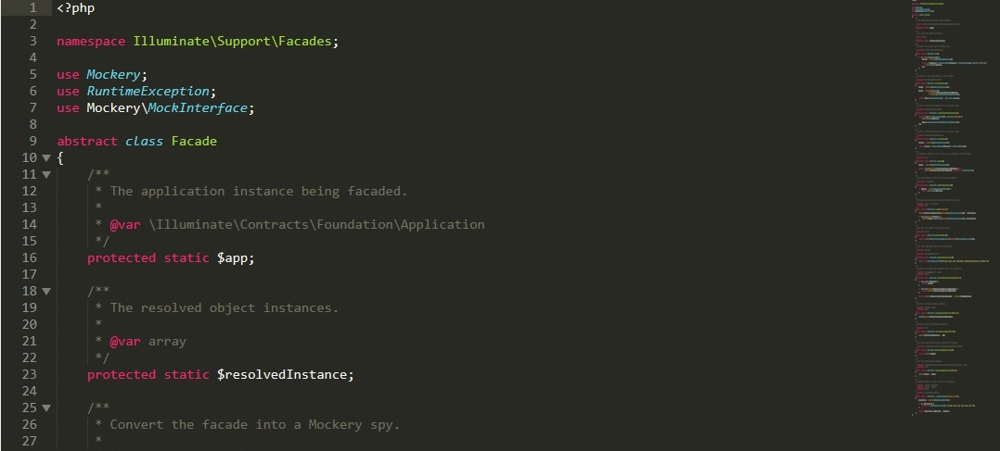

# PatronesDeDise-o
Explicacion Utilizando Laravel

## Patron Builder
Este patron separa la creación de un objeto complejo de su estructura, de tal forma que el mismo proceso de construcción nos puede servir para crear representaciones diferentes.

## Patron Repositorios
Este consiste en crear una capa intermedia entrre la aplicacion y la fuente de datos. Ninguna de las partes tiene que conocer a la otra para llevar acabo sus respectivos trabajos, esto nos permite disponer de una arquitectura desacoplada y ayuda a su vez a la estabilidadd de la aplicacion.
* Aparte de crear una capa de abstraccion entre la fuente de datos y la logica de negocios, lo que ayuda a desacoplar el codígo removiendo dependencias directas, este patron nos permite cambiar mas facilmente la fuente de los datos sin tener que hacer modificaciones a la logica de negocios.
* Con respecto a su funcionamiento se crea una capa que fingirá las funciones de mediador entre el dominio de la aplicacion y los datos que le dan persistencia.
* Este patron se utiliza cuando se conoce con certeza que la fuente de datos puede cambiar a lo largo del tiempo, también puede ser utilizado en aplicaciones grandes para separar la lógica de negocio de la fuente de datos lo que mejora la escalabilidad y mantenebilidad de la misma

## Patron Fecade
Una facade (o fachada) es un objeto que crea una interfaz simplificada para tratar con otra parte del código más compleja, de tal forma que simplifica y aísla su uso. Un ejemplo podría ser crear una fachada para tratar con una clase de una librería externa.
* Este patron utiliza una interfaz a las clases que están disponibles en el contenedor de servicio de la aplicación. 
* Este es el aspecto de la Fecade de laravel 

